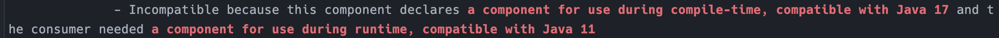
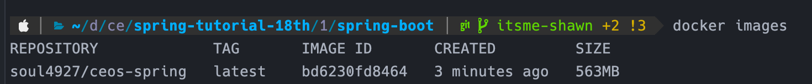

# 당근마켓 클론

---

# 🌱 2주차 미션

## 1️⃣ 당근 마켓의 DB를 모델링해요

- 물건 올리기
- 물건 찾기
- 1:1 채팅
- 구매 확정
- 리뷰(온도)

[당근마켓 모델링](https://www.erdcloud.com/d/za7jEwYXR2iz545rX)


DB 모델링

| 엔티티명(논리) | 테이블명(물리) | 설명 |
| --- | --- | --- |
| 회원 | members | 회원 정보를 저장 |
| 게시글 | posts | 회원은 여러 개의 게시글(중고물품)을 올릴 수 있음 |
| 게시글 이미지 | item_images | 게시글의 이미지 링크를 저장 |
| 카테고리 | categories | 게시글의 카테고리 범주 |
| 거래 완료 | completed_deals | 완료된 거래 |
| 거래 후기 | deal_reviews | 완료된 거래의 거래 후기 |
| 채팅방 | chat_rooms | 중고물건 게시글에 생성되는 채팅방 |
| 회원-채팅방 (연결테이블) | members_chatrooms | 회원 과 채팅방 을 매핑하는 테이블 |
| 채팅 메시지 | chat_messages | 채팅 발신자와 내용을 저장 |

### 모델링 과정에서 한 고민

**1. FK 를 꼭 다 써야할까?**  

   FK 쓸 때 장점 : 데이터 무결성, join 성능

   FK 안 쓸 때 장점 : 개발 편의성 향상, 확장에 유리, 수동으로 DB 작업이 편리, 진짜 혹시도 모를 대참사 방지(?)

   ( + FK 를 안 쓴다면 join 성능을 위해 인덱스 사용이 거의 필수적 )

   과제 모델링에서는 FK 를 적용했음


**2. 식별 vs 비식별**

   유연한 설계를 위해 비식별 관계를 선호함


**3. 당근마켓의 로그인 방식에 따른 회원 엔티티 설계**

  

   회원가입을 할 때 아이디, 패스워드 방식이 아닌 휴대폰 번호로 전송된 인증 코드를 인증하는 방식으로 회원가입이 완료된다. 아이디가 휴대폰 번호가 되는셈이고 패스워드는 따로 없다.


**4. 엔티티 네이밍 : 중고물건(items,product..) vs 게시글(post..)**

   일반적인 이커머스와 다르게 중고거래는 **물품**이 **게시글**의 역할도 겸한다.

   네이밍을 어떻게 할까 고민을 했는데, **게시글(posts)** 로 결정함

   근거

    - 당근 서비스 내 에서 글 쓰기 버튼을 클릭한 뒤 중고물품을 올리는 폼이 뜸
    - 물품에 대한 채팅방 보다는 게시글에 대한 채팅방이 더 자연스럽다고 생각

<br>

**5. 거래 완료 와 거래 후기**

   

   거래 완료 처리를 위해 items 테이블에 판매자와 구매자 컬럼을 둘 다 놓을 수 도 있겠지만, 거래 완료 테이블을 별도로 분리했음 <br><br>

   근거

    - nullable 한 FK 를 최대한 줄이고 싶었음 (구매자 ID)
    - 거래 라는 비즈니스 로직에서 거래 완료는 핵심 비즈니스 이므로 별도로 분리하는 것이 괜찮겠다고 생각함

<br>
   회원의 게시글 조회, 회원의 거래 완료 조회, 회원의 거래 후기 조회 의 성능을 위해 각 테이블에 member 를 참조한 FK 를 둠

<br>


**6. 회원의 채팅방을 조회할 때의 성능 고민**

- case 1) chat_room 테이블에 게시글(posts) 와 회원(members) 을 참조하는 FK가 존재

  


- 내가 판매자인 채팅방 조회

  members → posts → chat_rooms : 삼중조인 or `where…in` 사용

- 내가 구매(희망)자인 채팅방 조회

  members → chat_rooms : 조인


- case 2) chat_room 테이블에 판매자(seller_id) 컬럼을 FK 로 추가

  


chat_room 테이블에 판매자 id (member 참조 FK) 를 두는 역정규화

- 내가 판매자인 채팅방 조회

  members → chat_rooms : 조인

- 내가 구매자인 채팅방 조회

  members → chat_rooms : 조인


⇒ posts 테이블과 무관해지므로 case 1 보다 더 개선됨

- case 3) many to many 사이에 join table 추가

  


- 내가 판매자,구매자인 채팅방 조회

  members → members_chatrooms → chat_rooms : 삼중조인


장점

- 판매자, 구매자에 대한 로직 분기가 필요 없어짐
- 채팅방 에 대한 확장성도 증가해서 이 방식을 최종적으로 선택

  ⇒ 1:1 채팅이 아닌 단체 채팅도 쉽게 구현 가능


### 테이블 상세 설명

모든 테이블에 createdDate 와 updatedDate 컬럼이 존재합니다 (ERD 상에는 생략됨)
    


- 회원 (members)

  


- 회원탈퇴여부 : 탈퇴 시, DELETE 가 아닌 UPDATE 로 데이터 유지 및 사기 유저 방지
- 지역 : 깊게 들어가면 고려할 사항이 너무 많아서 우선은 단순 string 으로 처리
  

- 게시글 (posts)

  
  

- 게시글 이미지 (post_images)

  
  

- 카테고리 (categories)

  
  

- 거래 완료 (completed_deals)

  
  

- 거래 후기 (deal_reviews)

  
  

- 채팅방 (chat_rooms)

  
  

- 회원-채팅방 (members_chatrooms)

  
  

- 채팅 메시지 (chat_messages)

  


### 전체 연관 관계


---

## 2️⃣ Repository 단위 테스트를 진행해요

Post Entity 에대한 Repository 를 만들고 @DataJpaTest 를 통해 단위테스트를 해보자

```java
package com.ceos18.springboot.repository;

import com.ceos18.springboot.domain.entity.Category;
import com.ceos18.springboot.domain.entity.Member;
import com.ceos18.springboot.domain.entity.Post;
import com.ceos18.springboot.domain.entity.enums.DealType;
import com.ceos18.springboot.domain.entity.enums.PostStatus;
import org.junit.jupiter.api.Test;
import org.springframework.beans.factory.annotation.Autowired;
import org.springframework.boot.test.autoconfigure.orm.jpa.DataJpaTest;
import org.springframework.boot.test.autoconfigure.orm.jpa.TestEntityManager;

import java.math.BigDecimal;
import java.util.List;

import static org.junit.jupiter.api.Assertions.*;

import static org.assertj.core.api.Assertions.assertThat;

@DataJpaTest
public class PostRepositoryTest {

	@Autowired
	private TestEntityManager em;

	@Autowired
	private PostRepository postRepository;

	@Test
	public void testSaveAndFind() {
		// Given

		Category category = Category.builder()
				.name("도서")
				.build();

		Member member = Member.builder()
				.phoneNumber("010-1111-2222")
				.isWithdrawal(false)
				.mannerRating(BigDecimal.valueOf(36.5))
				.region("서울")
				.build();

		em.persist(category);
		em.persist(member);

		Post post1 = Post.builder()
				.category(category)
				.seller(member)
				.title("title")
				.dealType(DealType.SELL)
				.isPriceOffer(true)
				.status(PostStatus.SALE)
				.likedCount(0)
				.viewCount(0)
				.build();

		Post post2 = Post.builder()
				.category(category)
				.seller(member)
				.title("title")
				.dealType(DealType.SELL)
				.isPriceOffer(true)
				.status(PostStatus.SALE)
				.likedCount(0)
				.viewCount(0)
				.build();

		Post post3 = Post.builder()
				.category(category)
				.seller(member)
				.title("title")
				.dealType(DealType.SELL)
				.isPriceOffer(true)
				.status(PostStatus.SALE)
				.likedCount(0)
				.viewCount(0)
				.build();

		// When
		em.persist(post1);
		em.persist(post2);
		em.persist(post3);

		List<Post> posts = postRepository.findAll();

		// Then
		assertThat(posts).hasSize(3);
		assertThat(posts).contains(post1, post2, post3);
	}
}
```

- Post Entity 는 Category 와 Member 를 참조하고 있어서 Category 와 Member 인스턴스를 먼저 생성한 뒤 persist 해줘야 한다.
  <br><br>
- 테스트 통과

    

## TroubleShooting

- java springboot 에서는 패키지명으로 enum 이 안 된다
- 정확한 실수 계산이 필요할 때에는 float, double 대신 BigDecimal 을 사용하자
- [https://codingdog.tistory.com/entry/mysql-decimal-vs-double-고정-소수점과-부동-소수점](https://codingdog.tistory.com/entry/mysql-decimal-vs-double-%EA%B3%A0%EC%A0%95-%EC%86%8C%EC%88%98%EC%A0%90%EA%B3%BC-%EB%B6%80%EB%8F%99-%EC%86%8C%EC%88%98%EC%A0%90)

---

# 🌱3주차 미션

# 프로젝트 패키지 구조


Post (게시글) 도메인에 대해 CRUD 를 만들어봅시다.

현재 제 Post 엔티티는 아래와 같습니다.

```java
package com.ceos18.springboot.domain.entity;

import com.ceos18.springboot.domain.entity.base.BaseTimeEntity;
import com.ceos18.springboot.domain.entity.enums.DealType;
import com.ceos18.springboot.domain.entity.enums.PostStatus;
import jakarta.persistence.*;
import lombok.*;

import java.math.BigDecimal;
import java.time.LocalDateTime;

@Entity
@Getter
@Setter
@Table(name = "posts")
@Builder
@NoArgsConstructor
@AllArgsConstructor
public class Post extends BaseTimeEntity {
	@Id
	@GeneratedValue(strategy = GenerationType.IDENTITY)
	private Long id; // PK

	@ManyToOne
	@JoinColumn(name = "category_id", nullable = false)
	private Category category;

	@ManyToOne
	@JoinColumn(name = "seller_id", nullable = false)
	private Member seller;

	@Column(name = "title", nullable = false)
	private String title;

	@Column(name = "deal_type", nullable = false)
	@Enumerated(EnumType.STRING)
	private DealType dealType;

	@Column(name = "description")
	private String description;

	@Column(name = "deal_place")
	private String dealPlace;

	@Column(name = "price")
	private BigDecimal price;

	@Column(name = "is_price_offer", nullable = false)
	private Boolean isPriceOffer;

	@Column(name = "status", nullable = false)
	@Enumerated(EnumType.STRING)
	private PostStatus status;

	@Column(name = "liked_count", nullable = false)
	private int likedCount;

	@Column(name = "view_count", nullable = false)
	private int viewCount;

	@Column(name = "pullup_at")
	private LocalDateTime pullupAt;

}
```

Post 는 Category 와 Member(seller) 를 참조하고 있기 때문에 사전에 Category 와 Member 데이터가 필요합니다.

따라서 임시로 InitDb 라는 클래스에서 스프링이 구동될 때 Category 와 Member DB 를 만들어주도록 했습니다.

`InitDb`

```java
package com.ceos18.springboot;

import com.ceos18.springboot.domain.entity.Category;
import com.ceos18.springboot.domain.entity.Member;
import com.ceos18.springboot.repository.CategoryRepository;
import com.ceos18.springboot.repository.MemberRepository;
import jakarta.annotation.PostConstruct;
import jakarta.persistence.EntityManager;
import lombok.RequiredArgsConstructor;
import org.springframework.stereotype.Component;
import org.springframework.transaction.annotation.Transactional;

@Component
@RequiredArgsConstructor
public class InitDb {

	private final InitService initService;

	@PostConstruct
	public void init() {
		initService.dbInit1();
	}

	@Component
	@Transactional
	@RequiredArgsConstructor
	static class InitService {

		private final MemberRepository memberRepository;
		private final CategoryRepository categoryRepository;

		public void dbInit1() {
			System.out.println("Init1" + this.getClass());

			Member member = new Member();
			member.setPhoneNumber("010-1111-2222");
			member.setEmail("abc@gmail.com");

			memberRepository.save(member);

			Category category = new Category();
			category.setName("전자기기");

			categoryRepository.save(category);
		}

	}
}
```

Category 와 Member 하나씩을 save 해줍니다.


# API 설계


## post 생성

**POST : /api/v1/post**

- parameter : 없음
- request body

```java
{
  "title": "string",
  "categoryId": 0,
  "dealType": "SELL",
  "description": "string",
  "dealPlace": "string",
  "price": 0,
  "isPriceOffer": true
}
```

- 성공 response : post 의 id 를 반환

```java
1
```

## post 전체 조회

**GET : /api/v1/post**

- parameter : 없음
- request body : 없음

- 성공 response

```java
[
  {
    "id": 0,
    "category": {
      "id": 0,
      "name": "string"
    },
    "seller": {
      "id": 0,
      "nickName": "string"
    },
    "title": "string",
    "dealType": "SELL",
    "description": "string",
    "dealPlace": "string",
    "price": 0,
    "isPriceOffer": true,
    "status": "SALE",
    "likedCount": 0,
    "viewCount": 0,
    "pullupAt": "2023-10-07T14:29:51.516Z"
  }
]
```

## post 단건 조회

**GET : /api/v1/post/{postId}**

- parameter : postId
- request body : 없음

- 성공 response

```java
{
  "id": 0,
  "category": {
    "id": 0,
    "name": "string"
  },
  "seller": {
    "id": 0,
    "nickName": "string"
  },
  "title": "string",
  "dealType": "SELL",
  "description": "string",
  "dealPlace": "string",
  "price": 0,
  "isPriceOffer": true,
  "status": "SALE",
  "likedCount": 0,
  "viewCount": 0,
  "pullupAt": "2023-10-07T14:32:25.278Z"
}
```

## post 수정

**PATCH : /api/v1/post/{postId}**

- parameter : `postId`
- request body

    ```java
    {
      "title": "string",
      "categoryId": 0,
      "dealType": "SELL",
      "description": "string",
      "dealPlace": "string",
      "price": 0,
      "isPriceOffer": true
    }
    
    ```


- 성공 response : post 의 id 를 반환

```java
1
```

## post 삭제

**DELETE : /api/v1/post/{postId}**

- parameter : `postId`
- request body : 없음

- 성공 response : post 의 id 를 반환

```java
1
```

# Dto 생성

## request dto

`PostCreateRequestDto`

```java
@Getter
@NoArgsConstructor
public class PostCreateRequestDto {

	private String title;
	private Long categoryId;
	private DealType dealType;
	private String description;
	private String dealPlace;
	private BigDecimal price;
	private Boolean isPriceOffer;

}
```

- Post 를 생성할 때, 클라이언트 단에서 넘어올 값을 정의합니다.

`PostUpdateRequestDto`

```java
@Getter
@NoArgsConstructor
public class PostUpdateRequestDto {
	private String title;
	private Long categoryId;
	private DealType dealType;
	private String description;
	private String dealPlace;
	private BigDecimal price;
	private Boolean isPriceOffer;
}
```

- Post 를 수정할 때, 클라이언트 단에서 넘어올 값을 정의합니다.

## response dto

```java
@Getter
@Setter
public class PostReadResponseDto {
	private Long id;
	private CategoryVo category; // 연관관계
	private MemberVo seller; // // 연관관계
	private String title;
	private DealType dealType;
	private String description;
	private String dealPlace;
	private BigDecimal price;
	private Boolean isPriceOffer;
	private PostStatus status;
	private int likedCount;
	private int viewCount;
	private LocalDateTime pullupAt;

	public static PostReadResponseDto fromEntity(Post post) {
		PostReadResponseDto dto = new PostReadResponseDto();
		dto.setId(post.getId());
		dto.setCategory(CategoryVo.fromEntity(post.getCategory()));
		dto.setSeller(MemberVo.fromEntity(post.getSeller()));
		dto.setTitle(post.getTitle());
		dto.setDealType(post.getDealType());
		dto.setDescription(post.getDescription());
		dto.setDealPlace(post.getDealPlace());
		dto.setPrice(post.getPrice());
		dto.setIsPriceOffer(post.getIsPriceOffer());
		dto.setStatus(post.getStatus());
		dto.setLikedCount(post.getLikedCount());
		dto.setViewCount(post.getViewCount());
		dto.setPullupAt(post.getPullupAt());
		return dto;
	}

}
```

dto 에서 response 값을 아래처럼 주기 위해 내부적으로 CategoryVo 와 MemberVo 를 사용했습니다.

```java
{
  "id": 0,
  "category": {
    "id": 0,
    "name": "string"
  },
  "seller": {
    "id": 0,
    "nickName": "string"
  },
  "title": "string",
  "dealType": "SELL",
  "description": "string",
  "dealPlace": "string",
  "price": 0,
  "isPriceOffer": true,
  "status": "SALE",
  "likedCount": 0,
  "viewCount": 0,
  "pullupAt": "2023-10-07T14:32:25.278Z"
}
```

`CategoryVo`

```java
@Getter
@Setter
public class CategoryVo {
	private Long id;
	private String name;

	public static CategoryVo fromEntity(Category category) {
		CategoryVo categoryVo = new CategoryVo();
		categoryVo.setId(category.getId());
		categoryVo.setName(category.getName());
		return categoryVo;
	}

	public Category toEntity() {
		Category category = new Category();
		category.setId(this.id);
		category.setName(this.name);
		return category;
	}
}
```

`MemberVo`

```java
@Getter
@Setter
public class MemberVo {
	private Long id;
	private String nickName;

	public static MemberVo fromEntity(Member member) {
		MemberVo memberVo = new MemberVo();
		memberVo.setId(member.getId());
		memberVo.setNickName(member.getNickName());
		return memberVo;
	}

	public Member toEntity() {
		Member member = new Member();
		member.setId(this.id);
		member.setNickName(this.nickName);
		return member;
	}
}
```

# Controller

`PostApiController`

```java
@RequiredArgsConstructor
@RestController
@RequestMapping("/api")
public class PostApiController {
	private final PostService postService;

	// 등록
	@PostMapping("/v1/post")
	public Long createPost(@RequestBody PostCreateRequestDto requestDto) {

		// TODO : 나중에 헤더의 토큰에서 member id 뽑아오는 로직 필요
		Long memberId = 1L; // 지금은 임시로 member id를 1 로 설정

		return postService.createPost(requestDto, memberId);
	}

	// 전체 조회
	@GetMapping("/v1/post/")
	public List<PostReadResponseDto> findAllPosts() {
		return postService.findAllPosts();
	}

	// 단건 조회
	@GetMapping("/v1/post/{postId}")
	public PostReadResponseDto findPost(@PathVariable("postId") Long postId) {
		return postService.findPost(postId);
	}

	// 수정
	@PatchMapping("/v1/post/{postId}")
	public Long updatePost(@PathVariable("postId") Long postId, @RequestBody PostUpdateRequestDto requestDto) {

		Long memberId = 1L; // 지금은 임시로 member id를 1 로 설정

		return postService.updatePost(requestDto, postId, memberId);
	}

	//삭제
	@DeleteMapping("/v1/post/{postId}")
	public Long deletePost(@PathVariable("postId") Long postId) {

		Long memberId = 1L; // 지금은 임시로 member id를 1 로 설정

		return postService.deletePost(postId, memberId);
	}

}
```

- 권한 체크를 위해 memberId 를 임시로 설정하고 Service 단에 넘겨주어서 체크하도록 했습니다.

# Service

`PostService`

```java
@Service
@Transactional(readOnly = true)
@RequiredArgsConstructor
public class PostService {

	private final PostRepository postRepository;
	private final CategoryRepository categoryRepository;
	private final MemberRepository memberRepository;
//	private final ModelMapper modelMapper;

	/**
	 * 게시글 등록
	 */
	@Transactional
	public Long createPost(PostCreateRequestDto requestDto, Long memberId) {

		Category category = categoryRepository.findById(requestDto.getCategoryId())
				.orElseThrow(() -> new IllegalArgumentException("해당 카테고리가 없습니다. id=" + requestDto.getCategoryId()));

		Member member = memberRepository.findById(memberId)
				.orElseThrow(() -> new IllegalArgumentException("해당 멤버가 없습니다. id=" + memberId));

		Post post = Post.builder()
				.category(category)
				.seller(member)
				.title(requestDto.getTitle())
				.dealType(requestDto.getDealType())
				.description(requestDto.getDescription())
				.dealPlace(requestDto.getDealPlace())
				.price(requestDto.getPrice())
				.isPriceOffer(requestDto.getIsPriceOffer())
				.status(PostStatus.SALE)
				.likedCount(0)
				.viewCount(0)
				.build();

		return postRepository.save(post).getId();
	}

	/**
	 * 게시글 전체 조회
	 */
	public List<PostReadResponseDto> findAllPosts() {
		List<Post> posts = postRepository.findAll();
		return posts.stream()
				.map(PostReadResponseDto::fromEntity)
				.collect(Collectors.toList());
	}

	/**
	 * 게시글 단건 조회
	 */
	public PostReadResponseDto findPost(Long postId) {
		Post post =  postRepository.findById(postId)
				.orElseThrow(() -> new IllegalArgumentException("해당 게시글이 없습니다. id=" + postId));

		// return modelMapper.map(post, PostReadResponseDto.class);
		return PostReadResponseDto.fromEntity(post);
	}

	/**
	 * 게시글 수정
	 */
	@Transactional
	public Long updatePost(PostUpdateRequestDto requestDto, Long postId, Long memberId) {
		Post post = postRepository.findById(postId)
				.orElseThrow(() -> new IllegalArgumentException("해당 게시글이 없습니다. id=" + postId));

		// 게시글 작성자와 수정 요청자가 같은지 확인
		if (post.getSeller().getId() != memberId) {
			throw new IllegalArgumentException("게시글 작성자와 수정 요청자가 같지 않습니다.");
		}

		// requestDto.getCategoryId 가 있을 때
		Category category = null;
		if (requestDto.getCategoryId() != null) {
			category = categoryRepository.findById(requestDto.getCategoryId())
					.orElseThrow(() -> new IllegalArgumentException("해당 카테고리가 없습니다. id=" + requestDto.getCategoryId()));
		}

		post.setTitle(requestDto.getTitle());

		if (category != null) {
			post.setCategory(category);
		}

		post.setDealType(requestDto.getDealType());
		post.setDescription(requestDto.getDescription());
		post.setDealPlace(requestDto.getDealPlace());
		post.setPrice(requestDto.getPrice());
		post.setIsPriceOffer(requestDto.getIsPriceOffer());

		return postId;
	}

	/**
	 * 게시글 삭제
	 */
	@Transactional
	public Long deletePost(Long postId, Long memberId) {
		Post post = postRepository.findById(postId)
				.orElseThrow(() -> new IllegalArgumentException("해당 게시글이 없습니다. id=" + postId));

		// 게시글 작성자와 삭제 요청자가 같은지 확인
		if (post.getSeller().getId() != memberId) {
			throw new IllegalArgumentException("게시글 작성자와 삭제 요청자가 같지 않습니다.");
		}

		postRepository.delete(post);
		return postId;
	}

}
```

# Repository

repository 는 별도의 커스텀메스더를 사용하지 않고 JpaRepository 에서 지원하는 메서드를 그대로 사용했습니다.

```java
package com.ceos18.springboot.repository;

import com.ceos18.springboot.domain.entity.Post;
import org.springframework.data.jpa.repository.JpaRepository;

public interface PostRepository extends JpaRepository<Post, Long> {

}
```

# api 테스트

통합테스트 코드를 따로 짜진 않았고 swagger 상에서 직접 테스트를 진행했습니다.

## post 생성


## post 전체 조회


```java
[
  {
    "id": 1,
    "category": {
      "id": 1,
      "name": "전자기기"
    },
    "seller": {
      "id": 1,
      "nickName": null
    },
    "title": "t1",
    "dealType": "SELL",
    "description": "string",
    "dealPlace": "string",
    "price": 0,
    "isPriceOffer": true,
    "status": "SALE",
    "likedCount": 0,
    "viewCount": 0,
    "pullupAt": null
  },
  {
    "id": 2,
    "category": {
      "id": 1,
      "name": "전자기기"
    },
    "seller": {
      "id": 1,
      "nickName": null
    },
    "title": "t2",
    "dealType": "SELL",
    "description": "string",
    "dealPlace": "string",
    "price": 0,
    "isPriceOffer": true,
    "status": "SALE",
    "likedCount": 0,
    "viewCount": 0,
    "pullupAt": null
  }
]
```

## post 단건 조회


## post 수정


title 을 수정해보겠습니다


## post 삭제


---

# 느낀 점 및 고민

- 지연로딩 세팅 및 N+1 문제 해결해야 합니다
- controller 에서 service 단에 데이터를 넘겨줄 때 어떻게 해야 더 깔끔하게 넘겨줄 수 있을 지 고민입니다.
- service 단에서 인터페이스와 impl 패턴 사용 시 장단점과 프로젝트에서 적용 여부에 대한 고민
- vo 를 이렇게 쓰는게 맞는건지에 대한 의문
- 커맨드, 쿼리를 분리하는 패턴 또한 우리 수준 프로젝트에서 유의미한 장점이 있을까 하는 고민

---

# 🌱 4주차 미션

# 1️⃣ JWT 인증(Authentication) 방법에 대해서 알아보기

## 인증 vs 인가

```
인증 : 이 서비스에서 해당 사용자가 유효함을 확인
인가 : 사용자 인증이 이뤄진 뒤, 사용자가 접근하는 리소스(자원)에 대해서 권한을 확인 및 제한
```

## JWT를 이용한 인증 방식 (access token, refresh token)

### 개념적

A. JWT 인증 전반적인 발전과정.

```
1. 우선, 초기엔 하나의 토큰 access_token 만 존재하여, 사용자 인증을 진행하였음.

2. 다만, access_token 은 저장되는 값이 아니기에 유출되었을 때, 서버에서 이를 잘못된 사용자인지 판단할 수 없음.

3. 그렇기에 Lifespan(토큰 생존주기) 를 짧게 설정하여 이를 최대한 방어하였음.

4. 그 결과, 유저가 로그인을 자주해야하는 상황이 발생.
```

B. access_token / refresh_token

```
1. access_token 은 (1시간 ~ 1일, 금융 등 중요 기관에선 30초) 등 짧은 Lifespan. (저장되지 않음)

2. refresh_token 은 (2주, 1달, 영구) 등 긴 Lifespan을 가지게 되었음.

3. 이로인해 앞서 유저가 토큰 만료로 로그인해야하는 시점에 refresh_token으로 access_token을 재 발급받음.

4. 여기서 물음이 드는것은 그러면 refresh_token이 유출되면 똑같이 문제 아닌가?
   => 이건 어쩔 수 없음. refresh token 이 탈취됨을 인지하고 DB 에서 만료시키거나, refresh_toekn 이 만료되지 않는 이상 보안 문제가 발생
```

C. refresh_token 좀 더 자세히

```
1. aceess_token 은 어딘가 저장되지않고(프론트에는 저장되겠지만) 토큰 자체를 해석해서 인증을 하는것과 달리.

2. refresh_token 은 토큰 자체에 유저정보도 있지만, DB(database, file, redis 등)에 저장되는 값임, 그렇기에 서버측의 의도로 만료시킬 수 있음. (기술적으로, refresh_token 을 저장하지 않고 유저 로그와 refresh_token을 대조 하는 등 다른 방법도 있음.)

3. 그렇기에 특수한 상황(다른 디바이스 접속, 다른 아이피 접속, 다른 지역 접속 등)에 서버가 임의로 만료시킬 수 있음.

4. 대규모 서비스에서 access_token 은 우리가 개발한 API 서버(Resource Server)로 전달되겠지만. refresh_token은 우리 API 서버가 아닌 별도의 인증서버(Authorization Server)에서 처리해주는것이 일반적
```

D. 인증서버(Authorization Server)

```
1. 소규모 프로젝트에선 하나의 서버에서 관리하겠지만.

2. 대규모 서비스의 경우 별도로 인증서버를 관리함(Authorization 서버와 Resource 서버를 분리하는게 더 일반적인 아키텍쳐)

3. 또한 우리가 사용하는 SNS 로그인, Cognito(AWS)로그인 등은 인증서버가 해당 회사 인증 서버(AWS, Facebook, Kakaotalk)임

4. 해당 인증서버에서는 refresh_token으로 요청한다고 바로 access_token을 주는게 아닌, 여러방법으로 보안을 유지함.

E. 보안 유지 방법.
1. 앞서 말한 상황(다른 디바이스 접속, 다른 아이피 접속, 다른 지역 접속 등)시 refresh_token 만료 시키고 재로그인 요구.

2. 추가적으로 사용자인증(휴대폰 문자 인증 등)을 요구.
3. 등

즉, access_token 을 탈취하기엔 생명주기가 짧아 이를 방지하고,  공격자가 refresh_token 을 탈취하더라도, Authorization 서버의 인증, 보안 절차로 인해 공격이 어렵게 된다.
```

## 세션/쿠키 방식 vs JWT

### 세션 인증 방식의 플로우

](ceos_4주차_img/Untitled.png)

[https://velog.io/@gusdnr814/로그인-인증-4가지-방법](https://velog.io/@gusdnr814/%EB%A1%9C%EA%B7%B8%EC%9D%B8-%EC%9D%B8%EC%A6%9D-4%EA%B0%80%EC%A7%80-%EB%B0%A9%EB%B2%95)

- 세션 인증은 쿠키를 같이 사용함

### JWT 인증 방식의 플로우

](ceos_4주차_img/Untitled%201.png)

[https://llshl.tistory.com/32](https://llshl.tistory.com/32)

- JWT 방식의 장점
  - 무상태성(stateless) : JWT 자체에 정보를 포훔하가 있으므로 서버에 저장할 필요가 없다.
  - 확장성 : 분산 아키텍쳐에서 우리
  - 서버 부하 감소

- JWT 방식의 단점
  - 토큰의 크기가 커지면 네트워크 비용이 증가할 수 있음
  - 누구나 토큰을 디코딩 할 수 있으므로 민감한 정보는 토큰에 담지 못함
  - 서버에서 토큰을 강제로 만료시키기 어려움 → but, access token 의 주기를 짧게 하고, refresh token 을 사용함으로써 어느 정도 해결 가능
  - 구현이 세션 방식보다 복잡

# 2️⃣ 액세스 토큰 발급 및 검증 로직 구현하기

## 구현한 파트

```
- ID/PW 로 회원가입
- 로그인
- 로그인 시 access toekn 발급
- access token 으로 사용자 식별
- 사용자 권한에 따라 api 호출 허용 or 제한
```

## 구현 코드

### 디렉터리 구조

```
.
├── Application.java
├── InitDb.java
├── config
│   ├── ModelMapperConfig.java
│   ├── OpenApiConfig.java
│   └── P6SpyFormatter.java
├── controller
│   ├── PostApiController.java
│   └── SignController.java
├── dto
│   ├── post
│   │   ├── request
│   │   └── response
│   ├── signIn
│   │   ├── request
│   │   └── response
│   └── signUp
│       ├── request
│       └── response
├── entity
│   ├── Category.java
│   ├── ChatMessage.java
│   ├── ChatRoom.java
│   ├── CompletedDeal.java
│   ├── DealReview.java
│   ├── Member.java
│   ├── MembersChatRoom.java
│   ├── Post.java
│   ├── PostImage.java
│   ├── base
│   │   └── BaseTimeEntity.java
│   └── enums
│       ├── DealType.java
│       ├── MemberRole.java
│       └── PostStatus.java
├── repository
│   ├── CategoryRepository.java
│   ├── MemberRepository.java
│   └── PostRepository.java
├── security
│   ├── JwtAuthenticationFilter.java
│   ├── SecurityConfig.java
│   ├── TokenProvider.java
│   └── authorize
│       ├── AdminAuthorize.java
│       └── UserAuthorize.java
├── service
│   ├── PostService.java
│   └── SignService.java
└── vo
    ├── CategoryVo.java
    └── MemberVo.java
```

### 패키지 설치

```java
// spring security , jwt
	implementation 'org.springframework.boot:spring-boot-starter-security'
	implementation 'io.jsonwebtoken:jjwt-api:0.11.2'
	implementation 'io.jsonwebtoken:jjwt-impl:0.11.2'
	implementation 'io.jsonwebtoken:jjwt-jackson:0.11.2'
```

### 회원가입(sign up), 로그인(sign in) req,res dto

🔖 `SignInRequestDto`

```java
package com.ceos18.springboot.dto.signIn.request;

import io.swagger.v3.oas.annotations.media.Schema;
import lombok.Getter;
import lombok.NoArgsConstructor;

@Getter
@NoArgsConstructor
public class SignInRequestDto {
	@Schema(description = "회원 아이디", example = "abc123")
	String account;
	@Schema(description = "회원 비밀번호", example = "1234")
	String password;
}
```

🔖 `SignInResponseDto`

```java
package com.ceos18.springboot.dto.signIn.response;

import com.ceos18.springboot.entity.enums.MemberRole;
import io.swagger.v3.oas.annotations.media.Schema;
import lombok.Getter;
import lombok.NoArgsConstructor;
import lombok.Setter;

@Getter
@Setter
@NoArgsConstructor
public class SignInResponseDto {

	String email;
	String accessToken;
	String refreshToken;
	String nickName;
	@Schema(description = "회원 롤", example = "USER")
	MemberRole role;

	public SignInResponseDto(String email, String accessToken, String refreshToken, String nickName, MemberRole role) {
		this.email = email;
		this.accessToken = accessToken;
		this.refreshToken = refreshToken;
		this.nickName = nickName;
		this.role = role;
	}
}
```

🔖 `SignUpRequestDto`

```java
package com.ceos18.springboot.dto.signUp.request;

import io.swagger.v3.oas.annotations.media.Schema;
import lombok.Getter;
import lombok.NoArgsConstructor;

@Getter
@NoArgsConstructor
public class SignUpRequestDto {
	@Schema(description = "회원 아이디", example = "abc123")
	String account;
	@Schema(description = "회원 비밀번호", example = "1234")
	String password;
	@Schema(description = "회원 이메일", example = "abc@gmail.com")
	String email;
	@Schema(description = "회원 닉네임", example = "별명")
	String nickName;
}
```

🔖 `SignUpResponseDto`

```java
@Getter
@Setter
public class SignUpResponseDto {

	@Schema(description = "회원 아이디", example = "1")
	Long id;
	@Schema(description = "회원 아이디", example = "abc123")
	String account;
	@Schema(description = "회원 이메일", example = "abc@gmail.com")
	String email;
	@Schema(description = "회원 닉네임", example = "별명")
	String nickName;

	public static SignUpResponseDto from(Member member) {
		SignUpResponseDto signUpResponseDto = new SignUpResponseDto();
		signUpResponseDto.setId(member.getId());
		signUpResponseDto.setAccount(member.getAccount());
		signUpResponseDto.setEmail(member.getEmail());
		signUpResponseDto.setNickName(member.getNickName());
		return signUpResponseDto;
	}
}
```

### SignService

```java
@RequiredArgsConstructor
@Service
public class SignService {
	private final MemberRepository memberRepository;
	private final TokenProvider tokenProvider;
	private final PasswordEncoder encoder;

	@Transactional
	public SignUpResponseDto registMember(SignUpRequestDto request) {
		Member member = memberRepository.save(Member.from(request, encoder));
		try {
			memberRepository.flush();
		} catch (DataIntegrityViolationException e) {
			throw new IllegalArgumentException("이미 사용중인 아이디입니다.");
		}
		return SignUpResponseDto.from(member);
	}

	@Transactional(readOnly = true)
	public SignInResponseDto signIn(SignInRequestDto request) {
		Member member = memberRepository.findByAccount(request.getAccount())
				.filter(it -> encoder.matches(request.getPassword(), it.getPassword()))	// 암호화된 비밀번호와 비교하도록 수정
				.orElseThrow(() -> new IllegalArgumentException("아이디 또는 비밀번호가 일치하지 않습니다."));

		String token = tokenProvider.createToken(String.format("%s:%s", member.getId(), member.getRole().name()));

		// email, refresh token, nickName
		return new SignInResponseDto(member.getEmail(), token, member.getRefreshToken(), member.getNickName(), member.getRole());
	}
}
```

- 인증 서비스
  - `registMember()` (회원가입)
  - `signIn()` (로그인)

### SignController

```java
@Tag(name = "회원 가입 및 로그인")
@RequiredArgsConstructor
@RestController
@RequestMapping("/api/v1")
public class SignController {
	private final SignService signService;

	@Operation(summary = "회원 가입")
	@PostMapping("/sign-up")
	public SignUpResponseDto signUp(@RequestBody SignUpRequestDto request) {
		return signService.registMember(request);
	}

	@Operation(summary = "로그인")
	@PostMapping("/sign-in")
	public SignInResponseDto signIn(@RequestBody SignInRequestDto request) {
		return signService.signIn(request);
	}
}
```

### jwt 프로퍼티 설정

public repo 에 올라가지 않게끔 별도의 파일로 분리해서 관리

🔖 `resources/jwt.yml`

```java
secret-key: NiOeyFbN1Gqo10bPgUyTFsRMkJpGLXSvGP04eFqj5B30r5TcrtlSXfQ7TndvYjNvfkEKLqILn0j1SmKODO1Yw3JpBBgI3nVPEahqxeY8qbPSFGyzyEVxnl4AQcrnVneI
expiration-hours: 3
issuer: abc123
```

### TokenProvider

JWT 를 생성하고 유효성을 검증

```java
@PropertySource("classpath:jwt.yml")
@Service
public class TokenProvider {
	private final String secretKey;
	private final long expirationHours;
	private final String issuer;

	public TokenProvider(
			@Value("${secret-key}") String secretKey,
			@Value("${expiration-hours}") long expirationHours,
			@Value("${issuer}") String issuer
	) {
		this.secretKey = secretKey;
		this.expirationHours = expirationHours;
		this.issuer = issuer;
	}

	public String createToken(String userSpecification) {
		return Jwts.builder()
				.signWith(new SecretKeySpec(secretKey.getBytes(), SignatureAlgorithm.HS512.getJcaName()))   // HS512 알고리즘을 사용하여 secretKey를 이용해 서명
				.setSubject(userSpecification)  // JWT 토큰 제목
				.setIssuer(issuer)  // JWT 토큰 발급자
				.setIssuedAt(Timestamp.valueOf(LocalDateTime.now()))    // JWT 토큰 발급 시간
				.setExpiration(Date.from(Instant.now().plus(expirationHours, ChronoUnit.HOURS)))    // JWT 토큰 만료 시간
				.compact(); // JWT 토큰 생성
	}

	public String validateTokenAndGetSubject(String token) {
		return Jwts.parserBuilder()
				.setSigningKey(secretKey.getBytes())
				.build()
				.parseClaimsJws(token)
				.getBody()
				.getSubject();
	}
}
```

- `createToken()` : SignService 에서 호출할 때 유저의 정보를 같이 넘겨줘서 유저 정보로 jwt 를 생성한다.
- `validateTokenAndGetSubject()` : 주어진 jwt 토큰을 검증하고, 유효한 토큰이라면 subject 를 반환한다.

### JwtAuthenticationFilter

토큰 정보에서 사용자 인증 필터

```java
@Order(0)
@RequiredArgsConstructor
@Component
public class JwtAuthenticationFilter extends OncePerRequestFilter {
	private final TokenProvider tokenProvider;

	@Override
	protected void doFilterInternal(HttpServletRequest request, HttpServletResponse response, FilterChain filterChain) throws ServletException, IOException {
		try {
			String token = parseBearerToken(request);
			User user = parseUserSpecification(token);
			AbstractAuthenticationToken authenticated = UsernamePasswordAuthenticationToken.authenticated(user, token, user.getAuthorities());
			authenticated.setDetails(new WebAuthenticationDetails(request));
			SecurityContextHolder.getContext().setAuthentication(authenticated);
		} catch (Exception e) {
			request.setAttribute("exception", e);
		}

		filterChain.doFilter(request, response);
	}

	private String parseBearerToken(HttpServletRequest request) {
		return Optional.ofNullable(request.getHeader(HttpHeaders.AUTHORIZATION))
				.filter(token -> token.substring(0, 7).equalsIgnoreCase("Bearer "))
				.map(token -> token.substring(7))
				.orElse(null);
	}

	private User parseUserSpecification(String token) {
		String[] split = Optional.ofNullable(token)
				.filter(subject -> subject.length() >= 10)
				.map(tokenProvider::validateTokenAndGetSubject)
				.orElse("anonymous:anonymous")
				.split(":");

		return new User(split[0], "", List.of(new SimpleGrantedAuthority(split[1])));
	}
}
```

- ****`doFilterInternal`****

  OncePerRequestFilter 를 상속받아서 구현한 시큐리티 필터

  모든 요청에 대해 한 번만 실행되고, 아래의 **`parseBearerToken` 와 `parseUserSpecification`** 를 호출함으로써 토큰에서 사용자 정보를 추출함


- ****`parseBearerToken`****

  HTTP 헤더에서 Bearer 토큰을 추출

- ****`parseUserSpecification`****

  추출한 Bearer 토큰에서 사용자 정보 파싱한 뒤 spring security 의 User 객체를 생성


### SecurityConfig 에서 필터 추가

앞서서 만든 `JwtAuthenticationFilter` 를 필터 체인에 추가한다.

```java
@EnableMethodSecurity
@RequiredArgsConstructor
@Configuration
public class SecurityConfig {

	private final JwtAuthenticationFilter jwtAuthenticationFilter;

	private final String[] allowedUrls = {"/swagger-ui/**", "/api/v1/sign-up", "/api/v1/sign-in"};

	@Bean
	public SecurityFilterChain filterChain(HttpSecurity http) throws Exception {
		return http
				.csrf().disable()
				.headers(headers -> headers.frameOptions().sameOrigin())
				.authorizeHttpRequests(requests ->
						requests.requestMatchers(allowedUrls).permitAll()
								.anyRequest().authenticated()
				)
				.sessionManagement(sessionManagement ->
						sessionManagement.sessionCreationPolicy(SessionCreationPolicy.STATELESS)
				)
				.addFilterBefore(jwtAuthenticationFilter, BasicAuthenticationFilter.class)	// 추가
				.build();
	}
```

### 인가를 위한 커스텀 인터페이스 생성

인가를 구현하기 위한 두 가지 방법

- Authorization Filter 구현해서 시큐리티 필터 체인에 등록
- 컨트롤러에 @PreAuthorize() 어노테이션 사용

두 번째 방법을 선택

편의를 위해 @PreAuthorize() 을 래핑하는 커스텀 인터페이스 생성

🔖 `AdminAuthorize`

```java
@Target({ElementType.METHOD, ElementType.TYPE})
@Retention(RetentionPolicy.RUNTIME)
@PreAuthorize("hasAuthority('ADMIN')")
public @interface AdminAuthorize {
}
```

🔖 `UserAuthorize`

```java
@Target({ElementType.METHOD, ElementType.TYPE})
@Retention(RetentionPolicy.RUNTIME)
@PreAuthorize("hasAuthority('USER')")
public @interface UserAuthorize {
}
```

PostApiController 에 USER role 을 가진 사용자만 호출하게끔 설정

```java
@RequiredArgsConstructor
@RestController
@RequestMapping("/api/v1")
@UserAuthorize
public class PostApiController {
	// 생략..
}
```

# 3️⃣ 테스트

### 🔖 인증 안 된 사용자가 api 호출할 때


➡️ 403 에러가 발생

### 🔖 회원가입

- request


- response


DB 에 password 암호화되서 잘 들어감

### 🔖 로그인

- request


- response


### 🔖 인증된 유저만 사용할 수 있는 api 호출

HTTP 요청의 헤더에 Bearer 토큰 등록


response 정상 응답

# 🌱 5주차 미션

# 1️⃣ 로컬에서 도커 실행해보기

## 1. jar 빌드

`./gradlew clean build`

## 2. Dockerfile

```docker
FROM openjdk:17
ARG JAR_FILE=/build/libs/*.jar
COPY ${JAR_FILE} app.jar
ENTRYPOINT ["java","-jar", "/app.jar"]
```

## 3. docker-compose 와 환경변수 설정

### dev 환경

`docker-compose-dev.yml`

dev profile : web 과 db 컨테이너를 모두 띄움

```yaml
version: "3.7"
services:
  db:
    image: mysql
    container_name: spring-daangn-db
    env_file:
      - .env.dev
    ports:
      - "3307:3306"
    volumes:
      - ./dockerDB:/app
    restart: always
  web:
    container_name: spring-daangn-server
    build:
      context: .
      dockerfile: Dockerfile
    ports:
      - "8082:8080"
    environment:
      - SPRING_PROFILES_ACTIVE=dev
    depends_on:
      - db
    restart: always
```

`application-dev.yml`

```yaml
spring:
  datasource:
    driver-class-name: com.mysql.cj.jdbc.Driver
    url: jdbc:mysql://db:3306/daangn?serverTimezone=Asia/Seoul
    username: root
    password: 1234
```

### local 환경

`docker-compose-local.yml`

local profile : web 만 띄우고, db 는 로컬db 에 붙음

```yaml
version: "3.7"
services:
  web:
    container_name: spring-daangn-server
    build:
      context: .
      dockerfile: Dockerfile
    ports:
      - "8082:8080"
    environment:
      - SPRING_PROFILES_ACTIVE=local
```

- SPRING_PROFILES_ACTIVE 로 local profile 주입

`application-local.yml`

```yaml
spring:
  datasource:
    driver-class-name: com.mysql.cj.jdbc.Driver
    url: jdbc:mysql://host.docker.internal:3306/ceos_18?serverTimezone=Asia/Seoul
    username: root
    password: <password>
```

- host 명이 `localhost` 가 아니라 `host.docker.internal` 임에 주의 (컨테이너 관점으로 생각)

1. 빌드 후 컨테이너 띄우기

   `./gradlew clean build`

   local : `docker-compose -f docker-compose-local.yml up --build`

   dev : `docker-compose -f docker-compose-dev.yml up --build`


# 트러블 슈팅

## 1. 자바 버전으로 인한 빌드 에러

인텔리제이 IDE 에서 빌드를 하는 것이 아니라 터미널 상에서 `./gradlew clean build` 커맨드로 빌드를 시도하였을 때 에러가 발생하였음

### 원인 : 자바 버전 문제

스프링부트3는 자바17 기반인데 현재 로컬에 설정된 자바는 자바11이였음

IDE 에서는 JDK17 을 설정해놨기 때문에 그동안 문제가 없었는데 터미널로 jar 를 빌드,실행할때는 문제가 발생




### 해결방법

- 로컬에 설치돼있는 다른 자바 버전 확인

  `/usr/libexec/java_home -V`


- JAVA_HOME 환경변수 변경

    ```bash
    export JAVA_HOME=$(/usr/libexec/java_home -v 17)
    ```


그런데 이렇게 하면 자바변경이 필요할 때마다 매번 환경변수를 바꿔줘야 하므로 번거로움

⇒ 자바 버전 변경 툴을 사용

- node 진영의 nvm 이나, python 의 pyenv 처럼 로컬의 자바버전 변경을 위한 툴
  - SDKMAN
  - jEnv
  - Jabba


SDKMAN 을 사용

1. SDKMAN 설치 및 초기화


    ```bash
    curl -s "https://get.sdkman.io" | bash
    ```
    
    ```bash
    source "$HOME/.sdkman/bin/sdkman-init.sh"
    ```


1. **원하는 자바 버전 설치:**
   사용 가능한 자바 버전 목록을 확인

    ```bash
    sdk list java
    ```

   그런 다음 원하는 버전을 선택하여 설치

    ```bash
    sdk install java 17.0.8-oracle
    ```


1. 자바 버전 적용
  - 전역 설정

      ```bash
      sdk default java 17.0.8-oracle
      ```

  - 쉘 설정 (쉘 나가면 버전 해제)

      ```bash
      sdk use java 17.0.8-oracle
      ```

  - 프로젝트별 설정 (프로젝트 루트에 .sdkmanrc 파일)

      ```bash
      echo "java=17.0.8-oracle" > .sdkmanrc
      ```


자바버전이 정상적으로 자바17 로 변경됨


빌드도 정상적으로 수행


## 2. web 컨테이너가 db 컨테이너에 못 붙는 이슈

```yaml
version: "3.7"
services:
  db:
    image: mysql
    container_name: spring-daangn-db
    env_file:
      - .env.dev
    ports:
      - "3307:3306"
    volumes:
      - ./dockerDB:/app
    restart: always
  web:
    container_name: spring-daangn-server
    build:
      context: .
      dockerfile: Dockerfile
    ports:
      - "8082:8080"
    environment:
      - SPRING_PROFILES_ACTIVE=dev
    depends_on:
      - db
    restart: always
```

depends_on 을 붙혔다고 해서 db 가 완전히 띄워진 다음에 web 컨테이너가 실행되는게 아니라

그냥 실행순서만 지정해주는 역할이라서 web 컨테이너에 `restart: always` 를 붙혀야 함

## 3. application profile 을 못 읽는 이슈

springboot 2.4 이후로 profile 지정 방법이 달라졌다고 함

`application-local.yml`

```yaml
spring:
  profiles: # 에러발생
    active: local # 에러발생
  datasource:
    driver-class-name: com.mysql.cj.jdbc.Driver
    url: jdbc:mysql://host.docker.internal:3306/ceos_18?serverTimezone=Asia/Seoul
    username: root
    password: <password>

  jpa:
    hibernate:
      ddl-auto: create
    properties:
      hibernate:
        default_batch_fetch_size: 100
    open-in-view: false
```

기존에는 yaml 파일 안에서 spring:profile:active 에서 원하는 profile 명을 써줬어야 하는데

springboot 2.4 이후로는 이렇게 하면 에러가 발생함

profile:active 부분을 지우고 application-{profile}.yml 로 파일이름만 지정하면 원하는 profile 을 잘 읽어옴

> 참고
>

spring 에서 application profile 을 읽는 순서

⇒ 기본 application.yml 을 먼저 읽고 지정한 application-{profile}.yml 을 그 위에 덮어 씌우는 방식으로 실행 (override 방식)

# ceos 스프링 6주차 미션

# 1️⃣ 도커 이미지 배포하기

### 1) EC2, RDS 인스턴스 생성

### 2) spring project 에서 RDS 인스턴스 연결 설정

`appication-prod.yml`

```yaml
spring:
  datasource:
    driver-class-name: com.mysql.cj.jdbc.Driver
    url: jdbc:mysql://<RDS 엔드포인트>:3306/daangn?serverTimezone=Asia/Seoul
    username: admin
    password: <RDS 비밀번호>
```

`docker-compose-prod.yml`

```yaml
version: "3.7"
services:
  web:
    platform: linux/amd64 # 플랫폼 설정
    image: soul4927/ceos-spring:latest
    container_name: spring-daangn-server
    build:
      context: .
      dockerfile: Dockerfile
    ports:
      - "80:8080"
    environment:
      - SPRING_PROFILES_ACTIVE=prod
```

- m1 mac 부터 arm cpu 라서 ubuntu 에서 배포할 때는 플랫폼을 amd64 로 설정해줘야 에러가 나지 않음

jar 빌드 후, 로컬에서 도커 컨테이너가 잘 올라가는지 테스트

`./gradlew clean build`

`docker-compose -f docker-compose-prod.yml up —-build`

### 3) docker hub 사용해서 EC2 에 수동배포

- 로컬에서 image 빌드

  `docker-compose -f docker-compose-prod.yml build`


- docker image 확인

  `docker images`

  

- docker 허브에 push

  `docker push <image명:tag명>`

  (default tag : latest )

  


docker hub repository 에 image push 됨


- ec2 접속


    - docker engine 설치 : [https://docs.docker.com/engine/install/ubuntu/#installation-methods](https://docs.docker.com/engine/install/ubuntu/#installation-methods)
    - docker-compose-prod.yml 작성
    - docker image pull
        
        `docker pull <repo명/image명:tag명>`
        
        
        
    
    - docker image run
        
        `sudo docker-compose -f docker-compose-prod.yml up`
        
        
        
    - http 배포는 완료
        
        


### 부족한 점

- github aciton 배포하려다가 막혀서 일단 수동으로 배포..

  


- https 인증 관련

  route 53 이 아닌 다른 도메인 업체에서 산 도메인이면 aws 에서 하는 설정 외에 부가적인 작업이 더 필요하더라구요

  해당 부분 더 찾아서 https 적용해보겠습니다